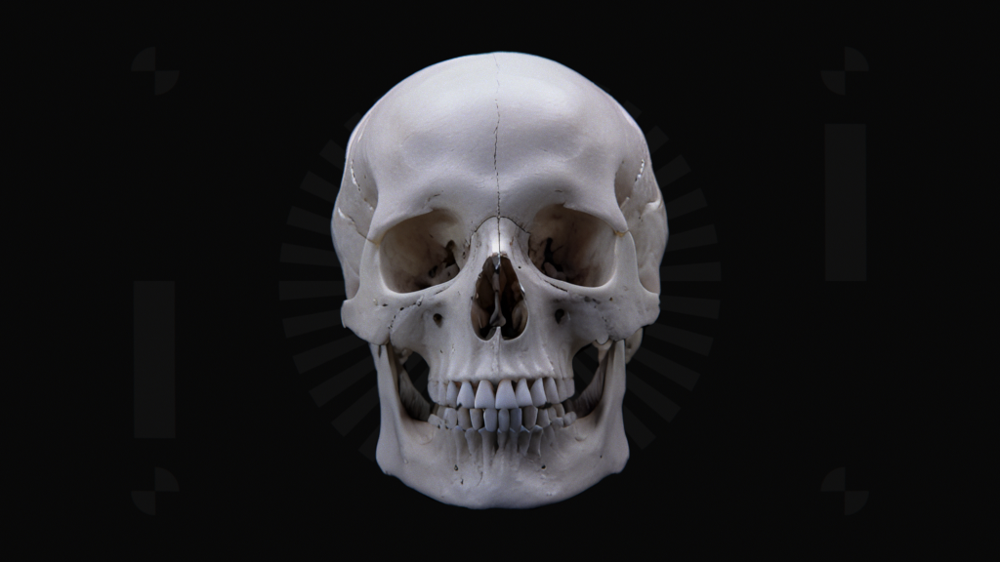

# PLAYHOUSE

**Project ID:** pLxS4aFn

<div align="center">
<picture>
  
</picture>
</div>

### Latent Diffusion
Abstract: *A **Latent Diffusion Engine (LDE)** is a machine learning model that generates images by gradually refining random noise into a coherent output. It operates in a latent space, where it reverses a diffusion process (turning noise back into data) to create high-quality results.*

## Installation
    git clone https://github.com/epochlab/PLAYHOUSE

Navigate into the `PLAYHOUSE` directory and clone `ComfyUI` then install the required packages.

    git clone https://github.com/comfyanonymous/ComfyUI.git
    pip install -r requirements.txt

Update model directory paths: `arch/extra_model_paths.yaml`

Run:
```
python arch/execute.py
```

## HyperConfig
Define the parameters by editing the HyperConfig class found in the `execute` script.

Parameter | Description
------- | -------
[Model](https://en.wikipedia.org/wiki/Stable_Diffusion) | The diffusion model choosen for inferance (eg. SDXL).
[LoRA](https://arxiv.org/pdf/2106.09685) | Low-Rank Adaptation; a fine-tuning technique for reducing the number of parameters trained.
[Controlnet](https://arxiv.org/pdf/2302.05543) | A network extension which controls image synthesis by adding extra conditions.
[Upscale](https://arxiv.org/pdf/1809.00219) | Generate high-resolution images from lower-resolution inputs by predicting and adding finer details to the image.
[Sampler](https://arxiv.org/pdf/2211.01095) | Direct the steps and processes by which noise is gradually refined into a coherent image.
[Scheduler](https://arxiv.org/pdf/2206.00364) | Control the timing and magnitude of updates applied to the model, impacting how noise is reduced across iterations.
[Denoise](https://arxiv.org/pdf/2112.10752) | The amount of denoise to apply to the latent source vector.
[CFG](https://arxiv.org/pdf/2207.12598) | Classifier-free guidance; scale how much the image generation process follows the text prompt.

## MODELS

## IO
Use [Houdini](www.sidefx.com) to dictate scene layout and generate the source imagery and required AOV's (Albedo, ZDepth, Normals and Curvature)

To ensure the generated images exhibit optical characteristics, use the [Nuke](https://www.foundry.com/products/nuke-family/non-commercial) framework to composite lens artifacts such as lens distortion, colour grading, noise/grain and chromatic aberration.

## Native Resolutions
```
SDXL | 1024x1024, 1152x896, 896x1152, 1216x832, 832x1216, 1344x768, 768x1344, 1536x640, 640x1536
2.35 | 1280x545, 1920x816, 2048x871
```
